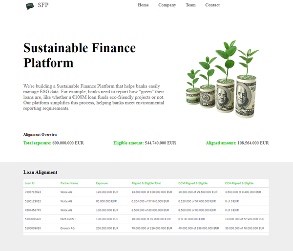

# Sustainable Finance Platform (SFP)



Welcome to the **Sustainable Finance Platform**! This application helps banks and financial institutions easily manage and report their ESG (Environmental, Social, and Governance) data, simplifying the process of tracking and reporting how "green" their loans are.

## Table of Contents
- [Overview](#overview)
- [Features](#features)
- [Installation](#installation)
- [Usage](#usage)
- [Testing](#testing)
- [Folder Structure](#folder-structure)

## Overview

The **SFP** enables banks to track, manage, and report the alignment and eligibility of their loans with environmental objectives, such as:
- Carbon Capture and Mitigation (CCM)
- Climate Change Adaptation (CCA)

It provides an interface for viewing detailed reports on loan alignments, exposure, and environmental eligibility data.

## Features

- Loan exposure and alignment overview
- Detailed loan alignment for CCM and CCA
- Easy-to-use and scalable UI with **React**
- Responsive design using **@ui5/webcomponents-react**
- JSON-based data structure for easy integration
- Simple number formatting for readability

## Installation

To get started with this project locally, follow these steps:

### Clone the Repository

```bash
git clone https://github.com/AdrianBirta/sustainable-finance-platform.git
cd sustainable-finance-platform
```

### Install Dependencies

```bash
npm install
```

## Usage

To start the development server and view the application locally:

```bash
npm run dev
```

The app will run on `http://localhost:5173` by default.

### Data Structure
Data for loans, products, and environmental KPIs are fetched from a local JSON file (`loans.json`). To view or modify this data, locate the file in the `/public` directory.

## Testing

This project uses **Cypress** for component testing. Here's how to run the tests:

### Run Cypress Tests

- Install Cypress (if not installed):
```bash
npm install cypress --save-dev
```

- To run component tests, use the following command:
```bash
npm run cypress:run
```

This will run Cypress component tests without recording videos (`--config video=false`) as defined in the `package.json` script:

```json
"scripts": {
  "cypress:run": "cypress run --config video=false --component"
}
```

### Cypress Configuration

- **Component Testing**: The `--component` flag in the script ensures Cypress runs in component testing mode.
- **Video**: The `--config video=false` flag disables video recording during tests to save resources.

## Folder Structure

The project is organized as follows:


- **sustainable-finance-platform/**
  - **public/** - Static assets, JSON data
    - `loans.json` - Loan and product data
  - **src/**
    - **assets/** - Images and icons
      - `tree.png` - Example image
      - `message.png` - Example image
    - **components/** - React components and Cypress test
      - `TableCustom.tsx` - Main table component
      - `TableCustom.cy.tsx` - Cypress component test for `TableCustom`
      - `interfaces.interface.ts` - TypeScript interfaces
    - `App.tsx` - Main entry point of the app
    - `App.css` - Main styling
    - `index.tsx` - React DOM rendering
  - `package.json` - Project metadata and dependencies
  - `README.md` - This file